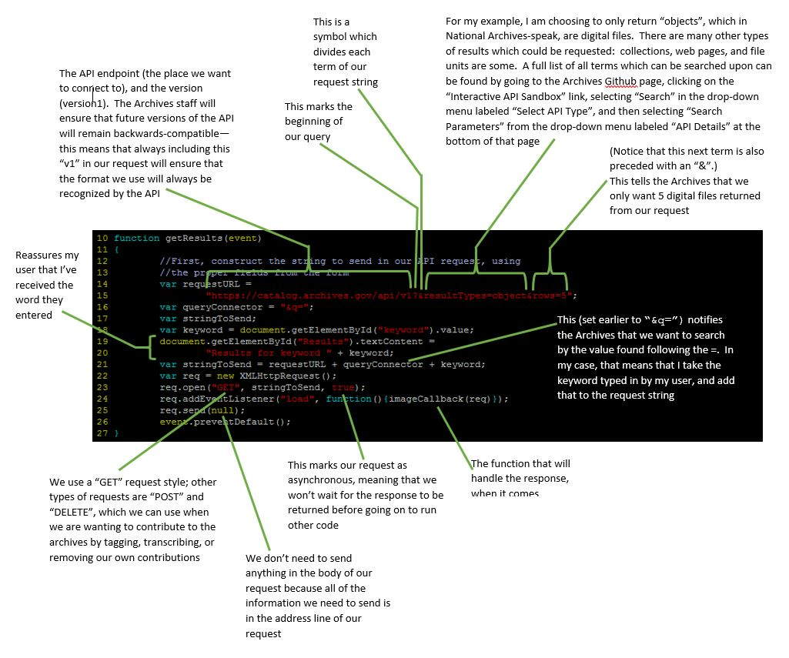
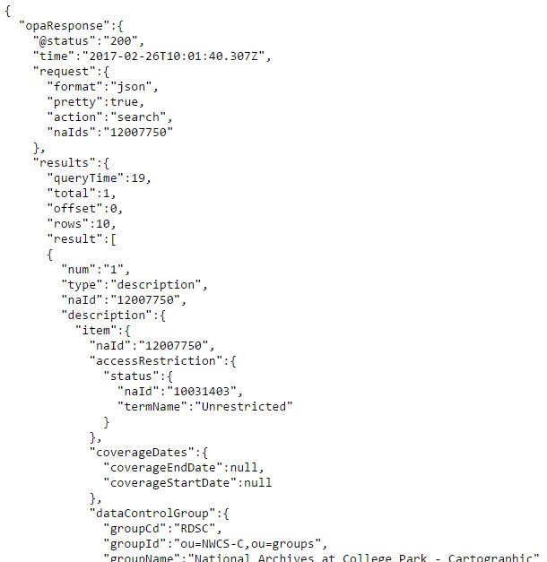
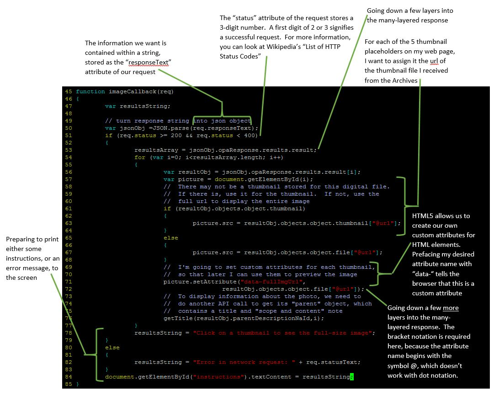
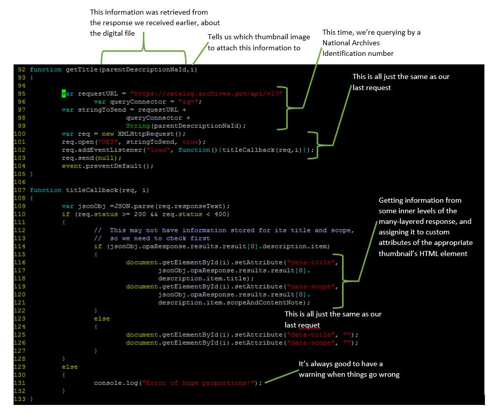
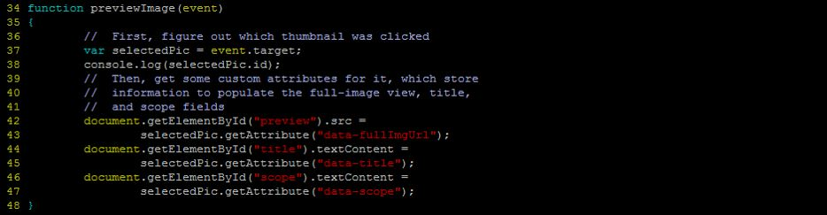

## Welcome!

This is a beginner’s guide to the United States National Archives Catalog API.  You can find the official documentation [here](https://github.com/usnationalarchives/Catalog-API).  But if the documentation seems a bit incomplete or unfriendly, not to worry.  You’ve come to the right place to get you started towards being able to use the API—and understand the documentation—yourself.

To illustrate the use of the API, I have built a simple application which uses it.  You can play around with it here.  The code which runs it is available here—there’s HTML5 for the page it’s on, a little CSS to change the look of the page, and some JavaScript.  We’ll inspect the JavaScript in detail below.

## Why use the National Archives API?

The National Archives Catalog API provides a way for developers to access the huge amount of data stored by the National Archives.  Items as diverse as George Washington's Farewell Address, Matthew Brady’s Civil War photographs, and World War II training videos are all part of their collections.  The API provides us with a way to request information on each item in the National Archives—things like item numbers, a digital file of any scan which has been made of the item, information on where it is stored, when it was acquired, and which collection it is part of.  But this is not all; the catalog API also gives us the opportunity to [contribute](https://www.archives.gov/citizen-archivist) to the National Archives.  We can become “citizen archivists”.  The National Archives provides information on several ways to contribute, but the API provides a way to contribute in only two ways so far (though others are planned):  tagging records and photos, and transcribing records.  In the [blog](https://narations.blogs.archives.gov/2016/04/25/the-new-read-write-api-for-our-catalog/) announcement of the catalog API’s launch, the Archives Office of Innovation says, “We believe it is one of the first public write APIs in operation at a cultural institution.”

## How do I send a request to the National Archives API?

So how do we avail ourselves of all of this great information?  You’re going to need some JavaScript code.  With JavaScript, we’ll construct a string which outlines the specific things we’re searching for in the Archives catalog.   See how it works with my example, then take a look at the code explanation below.

Here is the function getResults(), which I have programmed to run when my user wants to search for digital images by the keyword they’ve entered.  Piece by piece, I build a string which informs the browser where to send my request, and informs the Archives catalog which items I want to see.

Note:  the response sent back to us by the Archives is automatically ordered by its relevance to our search terms, in descending order.  If you wish to, you may request ordering by other information instead—for example, by date, or alphabetically.  Information on how to do that is [here](https://github.com/usnationalarchives/Catalog-API/blob/master/search_and_export.md#sorting-results).

## What do I do with a response from the National Archives API?

Here is where you’re probably going to run into problems.  There seems to be no official documentation on the format of the response from the API, and it varies depending on what kind of resultType you asked for (object, collection, etc.).  Your best bet is to send an experimental query and print it to the console as an object, and print it to the screen as a string.  Here's an example of a simple query you can experiment with: (this is sending a request for a digital file with the National Archives Identification number of 12007750):

 [https://catalog.archives.gov/api/v1?naIds=12007750]( https://catalog.archives.gov/api/v1?naIds=12007750)
 
You can print the response to the console, with code similar to the following:

And you can print the response to the screen by just typing the same query into your browser address window.  The response will look something like this, though it is too long to include in a graphic:

You can scan down through all of those indented brackets to find some information which looks useful to you.  Then you can use the console-logged object to hunt down your desired information's location within the response.  The response sent, even for only one digital file, is an intricate and many-leveled object—ten or eleven levels of nested objects and arrays of objects.  The reason printing this object to the console is advantageous is that the console provides a neatly collapsible outline view of the response object—clicking on a level will expand that level to show what it contains.  Clicking on it again will collapse it back to a single line so that you can more easily see what information is at which level in the object.

As an example of handling information from the response, here is my callback function which runs when the response is received.  Remember that I requested 5 digital files to be sent.

You’ll notice that at the end of the function shown above, I needed to make another API call to get some more information.  This is solely because my previous request returned only a digital file, and its title and information about it are included in its parent’s information.  The information you would like to use may very well not require two API requests.  Here is what the second API call looks like:

The last piece of code which runs my example application, is the code required to preview the image and print its title and “Scope and Content” information to the screen when my user clicks on its thumbnail.

The next logical step for my example application, would be to expand its capability to allow my user to log in to the Archives catalog, and tag the photo which they are currently previewing.

Why is tagging helpful?  It expands the information through which a digital file is searchable.  For example:  I came across a scanned historical photo of a geyser pool in Yellowstone National Park.  Its title was “Giantess, Yellowstone National Park”.  So I tagged the photo with the word “geyser”.  From now on if a National Archives user searches for photos of geysers, this historic photo of the Giantess geyser will come up in their search results.

My user can become a registered user with the National Archives [here](https://catalog.archives.gov/registration), or registration can be done using the API following [these](https://github.com/usnationalarchives/Catalog-API/blob/master/posting_contributions.md#api-authentication) instructions.  Following registration, allowing my user to tag the previewed photo would involve the following steps:

- When the photo is previewed, make a form visible which will allow the user to enter their user name and password.
- Extract my user’s National Archives username and password from the form, and send it in a request.  I will receive a credential code in response, which I need to append to the “POST” request with my user’s tags.  That will ensure that they receive credit for their tags.  This process is described [here](https://github.com/usnationalarchives/Catalog-API/blob/master/posting_contributions.md#public-contributions).
- After I have received a valid credential code to use with tagging, then I can allow my user to enter their desired tags, separated by commas.  I can send them all (along with the identification number of the digital image) as part of a “POST” request, and the Archives will parse them into separate tags.

## Conclusion
Hopefully by now, you feel more confident in tackling your own project using the National Archives Catalog API.  It’s a great way to get involved with United States history and culture.  If you have further questions, feel free to contact the National Archives Catalog team by e-mailing them at api@nara.gov or through their [Github issue tracker](https://github.com/usnationalarchives/Catalog-API/issues).

Cheryl Freeman, CS290-400, Winter 2017
